---
jupyter:
  kernelspec:
    display_name: Python 3 (ipykernel)
    language: python
    name: python3
  language_info:
    codemirror_mode:
      name: ipython
      version: 3
    file_extension: .py
    mimetype: text/x-python
    name: python
    nbconvert_exporter: python
    pygments_lexer: ipython3
    version: 3.9.7
  nbformat: 4
  nbformat_minor: 5
---

::: {#aff3fadb .cell .markdown}
# Lending Club Case Study
:::

::: {#2d6ffd0d .cell .markdown}
```{=html}
<h3>Importing Libs</h3>
```
:::

::: {#14d94746 .cell .code execution_count="1"}
``` python
import pandas as pd
import os
import matplotlib.pyplot as plt
import seaborn as sns
import numpy as np
```

::: {.output .stream .stderr}
    C:\Users\ayush\anaconda3\lib\site-packages\scipy\__init__.py:146: UserWarning: A NumPy version >=1.16.5 and <1.23.0 is required for this version of SciPy (detected version 1.24.3
      warnings.warn(f"A NumPy version >={np_minversion} and <{np_maxversion}"
:::
:::

::: {#4972dcea .cell .markdown}
```{=html}
<h3> Loading Data </h3>
```
:::

::: {#b8a519d3 .cell .code execution_count="2"}
``` python
dataset_path = os.path.join('loan', 'loan.csv')
df = pd.read_csv(dataset_path)
df.head()
```

::: {.output .stream .stderr}
    C:\Users\ayush\anaconda3\lib\site-packages\IPython\core\interactiveshell.py:3444: DtypeWarning: Columns (47) have mixed types.Specify dtype option on import or set low_memory=False.
      exec(code_obj, self.user_global_ns, self.user_ns)
:::

::: {.output .execute_result execution_count="2"}
```{=html}
<div>
<style scoped>
    .dataframe tbody tr th:only-of-type {
        vertical-align: middle;
    }

    .dataframe tbody tr th {
        vertical-align: top;
    }

    .dataframe thead th {
        text-align: right;
    }
</style>
<table border="1" class="dataframe">
  <thead>
    <tr style="text-align: right;">
      <th></th>
      <th>id</th>
      <th>member_id</th>
      <th>loan_amnt</th>
      <th>funded_amnt</th>
      <th>funded_amnt_inv</th>
      <th>term</th>
      <th>int_rate</th>
      <th>installment</th>
      <th>grade</th>
      <th>sub_grade</th>
      <th>...</th>
      <th>num_tl_90g_dpd_24m</th>
      <th>num_tl_op_past_12m</th>
      <th>pct_tl_nvr_dlq</th>
      <th>percent_bc_gt_75</th>
      <th>pub_rec_bankruptcies</th>
      <th>tax_liens</th>
      <th>tot_hi_cred_lim</th>
      <th>total_bal_ex_mort</th>
      <th>total_bc_limit</th>
      <th>total_il_high_credit_limit</th>
    </tr>
  </thead>
  <tbody>
    <tr>
      <th>0</th>
      <td>1077501</td>
      <td>1296599</td>
      <td>5000</td>
      <td>5000</td>
      <td>4975.0</td>
      <td>36 months</td>
      <td>10.65%</td>
      <td>162.87</td>
      <td>B</td>
      <td>B2</td>
      <td>...</td>
      <td>NaN</td>
      <td>NaN</td>
      <td>NaN</td>
      <td>NaN</td>
      <td>0.0</td>
      <td>0.0</td>
      <td>NaN</td>
      <td>NaN</td>
      <td>NaN</td>
      <td>NaN</td>
    </tr>
    <tr>
      <th>1</th>
      <td>1077430</td>
      <td>1314167</td>
      <td>2500</td>
      <td>2500</td>
      <td>2500.0</td>
      <td>60 months</td>
      <td>15.27%</td>
      <td>59.83</td>
      <td>C</td>
      <td>C4</td>
      <td>...</td>
      <td>NaN</td>
      <td>NaN</td>
      <td>NaN</td>
      <td>NaN</td>
      <td>0.0</td>
      <td>0.0</td>
      <td>NaN</td>
      <td>NaN</td>
      <td>NaN</td>
      <td>NaN</td>
    </tr>
    <tr>
      <th>2</th>
      <td>1077175</td>
      <td>1313524</td>
      <td>2400</td>
      <td>2400</td>
      <td>2400.0</td>
      <td>36 months</td>
      <td>15.96%</td>
      <td>84.33</td>
      <td>C</td>
      <td>C5</td>
      <td>...</td>
      <td>NaN</td>
      <td>NaN</td>
      <td>NaN</td>
      <td>NaN</td>
      <td>0.0</td>
      <td>0.0</td>
      <td>NaN</td>
      <td>NaN</td>
      <td>NaN</td>
      <td>NaN</td>
    </tr>
    <tr>
      <th>3</th>
      <td>1076863</td>
      <td>1277178</td>
      <td>10000</td>
      <td>10000</td>
      <td>10000.0</td>
      <td>36 months</td>
      <td>13.49%</td>
      <td>339.31</td>
      <td>C</td>
      <td>C1</td>
      <td>...</td>
      <td>NaN</td>
      <td>NaN</td>
      <td>NaN</td>
      <td>NaN</td>
      <td>0.0</td>
      <td>0.0</td>
      <td>NaN</td>
      <td>NaN</td>
      <td>NaN</td>
      <td>NaN</td>
    </tr>
    <tr>
      <th>4</th>
      <td>1075358</td>
      <td>1311748</td>
      <td>3000</td>
      <td>3000</td>
      <td>3000.0</td>
      <td>60 months</td>
      <td>12.69%</td>
      <td>67.79</td>
      <td>B</td>
      <td>B5</td>
      <td>...</td>
      <td>NaN</td>
      <td>NaN</td>
      <td>NaN</td>
      <td>NaN</td>
      <td>0.0</td>
      <td>0.0</td>
      <td>NaN</td>
      <td>NaN</td>
      <td>NaN</td>
      <td>NaN</td>
    </tr>
  </tbody>
</table>
<p>5 rows × 111 columns</p>
</div>
```
:::
:::

::: {#8b07af4c .cell .markdown}
```{=html}
<h3>Dataset size</h3>
```
:::

::: {#5947d205 .cell .code execution_count="3"}
``` python
df.shape
```

::: {.output .execute_result execution_count="3"}
    (39717, 111)
:::
:::

::: {#53a349c6 .cell .markdown}
```{=html}
<h3> Checking Null Values Count On Each Columns</h3>
```
:::

::: {#ea752819 .cell .code execution_count="4"}
``` python
null_counts = df.isnull().sum()
null_counts
```

::: {.output .execute_result execution_count="4"}
    id                                0
    member_id                         0
    loan_amnt                         0
    funded_amnt                       0
    funded_amnt_inv                   0
                                  ...  
    tax_liens                        39
    tot_hi_cred_lim               39717
    total_bal_ex_mort             39717
    total_bc_limit                39717
    total_il_high_credit_limit    39717
    Length: 111, dtype: int64
:::
:::

::: {#79a624eb .cell .markdown}
```{=html}
<h3>Removing All Columns which are completly Null</h3>
```
:::

::: {#6807285c .cell .code execution_count="5"}
``` python
df = df.dropna(axis=1, how='all')
df.shape
```

::: {.output .execute_result execution_count="5"}
    (39717, 57)
:::
:::

::: {#aa3f2163 .cell .markdown}
`<font color='red'>`{=html}Out of 111 Columns, 54 Columns contains only
null value`</font>`{=html}`<br>`{=html}
`<font color='red'>`{=html}Removed 54 Columns Now we have 57 Columns
left to Analysis`</font>`{=html}
:::

::: {#01ff333c .cell .markdown}
```{=html}
<h4>Now Analysing Null Value Count of Remaning Columns</h4>
```
:::

::: {#c7ee1197 .cell .code execution_count="6"}
``` python
# Count the null values in each column
null_counts = df.isnull().sum()
null_counts = null_counts[null_counts > 0]
# Create a bar plot
null_counts.plot(kind='bar')

# Customize the plot
plt.title('Null Values by Column', fontsize=14)
plt.xlabel('Columns', fontsize=12)
plt.ylabel('Number of Null Values (log scale)', fontsize=12)  # Update the y-label text
plt.xticks(rotation=45, ha='right', fontsize=10)

# Increase the size of the plot window
plt.figure(figsize=(12, 8))

# Display the plot
plt.tight_layout()
plt.show()
```

::: {.output .display_data}
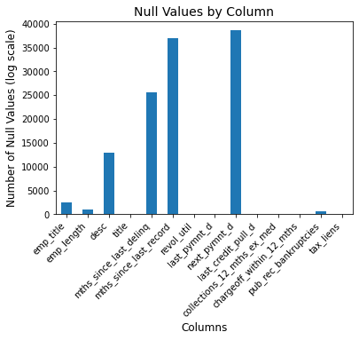
:::

::: {.output .display_data}
    <Figure size 864x576 with 0 Axes>
:::
:::

::: {#f8e3ccf6 .cell .markdown}
```{=html}
<h3>Removing below Columns as it not possible to fix Missing Values</h3>
```
    <br>

`<b>`{=html}`<font color="Blue">`{=html}mths_since_last_delinq`</font>`{=html} `</b>`{=html}
{The number of months since the borrower\'s last delinquency.}
`<br>`{=html}
`<b>`{=html}`<font color="Blue">`{=html}mths_since_last_record`</font>`{=html} `</b>`{=html}
{The number of months since the last public record.}`<br>`{=html}
`<b>`{=html}`<font color="Blue">`{=html}next_pymnt_d`</font>`{=html} `</b>`{=html}
{Next scheduled payment date}`<br>`{=html}

Also Removing
`<b>`{=html}`<font color="Blue">`{=html}desc`</font>`{=html} `</b>`{=html}
as it can\'t be standardised`<br>`{=html}
`<b>`{=html}`<font color="Blue">`{=html}desc`</font>`{=html} `</b>`{=html}
{Loan description provided by the borrower}`<br>`{=html}
:::

::: {#d531244d .cell .code execution_count="7"}
``` python
columns_to_drop = ['mths_since_last_delinq', 'mths_since_last_record', 'next_pymnt_d', 'desc']
df = df.drop(columns=columns_to_drop)
df.shape

```

::: {.output .execute_result execution_count="7"}
    (39717, 53)
:::
:::

::: {#5c4fab2e .cell .code execution_count="8"}
``` python
Final_columns = ['addr_state',
'annual_inc',
'collection_recovery_fee',
'delinq_2yrs',
'dti',
'earliest_cr_line',
'emp_length',
'funded_amnt',
'funded_amnt_inv',
'grade',
'home_ownership',
'initial_list_status',
'inq_last_6mths',
'installment',
'int_rate',
'issue_d',
'last_credit_pull_d',
'last_pymnt_amnt',
'last_pymnt_d',
'loan_amnt',
'loan_status',
'open_acc',
'out_prncp',
'out_prncp_inv',
'pub_rec',
'pub_rec_bankruptcies',
'purpose',
'recoveries',
'revol_bal',
'revol_util',
'sub_grade',
'term',
'total_acc',
'total_pymnt',
'total_pymnt_inv',
'total_rec_int',
'total_rec_late_fee',
'total_rec_prncp',
'verification_status']
df = df[Final_columns]
df.shape
```

::: {.output .execute_result execution_count="8"}
    (39717, 39)
:::
:::

::: {#1bd1d814 .cell .markdown}
```{=html}
<h6><font color='red'>Removed 4 columns now we left with 53 Columns</font></h6>
```
:::

::: {#7ffc673b .cell .code execution_count="9"}
``` python
# Count the null values in each column
null_counts = df.isnull().sum()
null_counts = null_counts[null_counts > 0]
# Create a bar plot
null_counts.plot(kind='bar')

# Customize the plot
plt.title('Null Values by Column', fontsize=14)
plt.xlabel('Columns', fontsize=12)
plt.ylabel('Number of Null Values (log scale)', fontsize=12)  # Update the y-label text
plt.xticks(rotation=45, ha='right', fontsize=10)

# Increase the size of the plot window
plt.figure(figsize=(12, 8))

# Display the plot
plt.tight_layout()
plt.show()
```

::: {.output .display_data}
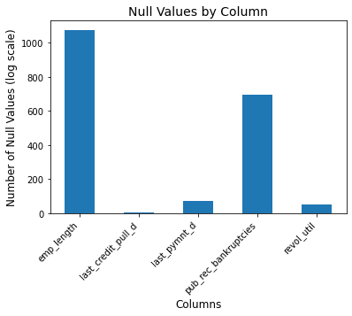
:::

::: {.output .display_data}
    <Figure size 864x576 with 0 Axes>
:::
:::

::: {#53eaa943 .cell .code execution_count="10"}
``` python
df.columns
```

::: {.output .execute_result execution_count="10"}
    Index(['addr_state', 'annual_inc', 'collection_recovery_fee', 'delinq_2yrs',
           'dti', 'earliest_cr_line', 'emp_length', 'funded_amnt',
           'funded_amnt_inv', 'grade', 'home_ownership', 'initial_list_status',
           'inq_last_6mths', 'installment', 'int_rate', 'issue_d',
           'last_credit_pull_d', 'last_pymnt_amnt', 'last_pymnt_d', 'loan_amnt',
           'loan_status', 'open_acc', 'out_prncp', 'out_prncp_inv', 'pub_rec',
           'pub_rec_bankruptcies', 'purpose', 'recoveries', 'revol_bal',
           'revol_util', 'sub_grade', 'term', 'total_acc', 'total_pymnt',
           'total_pymnt_inv', 'total_rec_int', 'total_rec_late_fee',
           'total_rec_prncp', 'verification_status'],
          dtype='object')
:::
:::

::: {#4f09950d .cell .code execution_count="11"}
``` python
#Check Missing Values in Rows
df.isnull().sum(axis=1)
```

::: {.output .execute_result execution_count="11"}
    0        0
    1        0
    2        0
    3        0
    4        0
            ..
    39712    1
    39713    1
    39714    1
    39715    1
    39716    1
    Length: 39717, dtype: int64
:::
:::

::: {#69016ef3 .cell .code execution_count="12"}
``` python
set(df['emp_length'])
```

::: {.output .execute_result execution_count="12"}
    {'1 year',
     '10+ years',
     '2 years',
     '3 years',
     '4 years',
     '5 years',
     '6 years',
     '7 years',
     '8 years',
     '9 years',
     '< 1 year',
     nan}
:::
:::

::: {#08166acf .cell .code execution_count="13"}
``` python
#In emp_length there are nan values present, filling 'nan' with 0
df['emp_length'] = df['emp_length'].fillna(0)
set(df['emp_length'])
```

::: {.output .execute_result execution_count="13"}
    {0,
     '1 year',
     '10+ years',
     '2 years',
     '3 years',
     '4 years',
     '5 years',
     '6 years',
     '7 years',
     '8 years',
     '9 years',
     '< 1 year'}
:::
:::

::: {#940762de .cell .code execution_count="14"}
``` python
set(df['home_ownership'])
```

::: {.output .execute_result execution_count="14"}
    {'MORTGAGE', 'NONE', 'OTHER', 'OWN', 'RENT'}
:::
:::

::: {#0cd6596a .cell .code execution_count="15"}
``` python
#Remove Records which have None
df = df[df['home_ownership']!='NONE']
set(df['home_ownership'])
```

::: {.output .execute_result execution_count="15"}
    {'MORTGAGE', 'OTHER', 'OWN', 'RENT'}
:::
:::

::: {#3b3e9f1d .cell .code execution_count="16"}
``` python
df.shape
```

::: {.output .execute_result execution_count="16"}
    (39714, 39)
:::
:::

::: {#957ac436 .cell .code execution_count="17" scrolled="true"}
``` python
df.info()
```

::: {.output .stream .stdout}
    <class 'pandas.core.frame.DataFrame'>
    Int64Index: 39714 entries, 0 to 39716
    Data columns (total 39 columns):
     #   Column                   Non-Null Count  Dtype  
    ---  ------                   --------------  -----  
     0   addr_state               39714 non-null  object 
     1   annual_inc               39714 non-null  float64
     2   collection_recovery_fee  39714 non-null  float64
     3   delinq_2yrs              39714 non-null  int64  
     4   dti                      39714 non-null  float64
     5   earliest_cr_line         39714 non-null  object 
     6   emp_length               39714 non-null  object 
     7   funded_amnt              39714 non-null  int64  
     8   funded_amnt_inv          39714 non-null  float64
     9   grade                    39714 non-null  object 
     10  home_ownership           39714 non-null  object 
     11  initial_list_status      39714 non-null  object 
     12  inq_last_6mths           39714 non-null  int64  
     13  installment              39714 non-null  float64
     14  int_rate                 39714 non-null  object 
     15  issue_d                  39714 non-null  object 
     16  last_credit_pull_d       39712 non-null  object 
     17  last_pymnt_amnt          39714 non-null  float64
     18  last_pymnt_d             39643 non-null  object 
     19  loan_amnt                39714 non-null  int64  
     20  loan_status              39714 non-null  object 
     21  open_acc                 39714 non-null  int64  
     22  out_prncp                39714 non-null  float64
     23  out_prncp_inv            39714 non-null  float64
     24  pub_rec                  39714 non-null  int64  
     25  pub_rec_bankruptcies     39020 non-null  float64
     26  purpose                  39714 non-null  object 
     27  recoveries               39714 non-null  float64
     28  revol_bal                39714 non-null  int64  
     29  revol_util               39664 non-null  object 
     30  sub_grade                39714 non-null  object 
     31  term                     39714 non-null  object 
     32  total_acc                39714 non-null  int64  
     33  total_pymnt              39714 non-null  float64
     34  total_pymnt_inv          39714 non-null  float64
     35  total_rec_int            39714 non-null  float64
     36  total_rec_late_fee       39714 non-null  float64
     37  total_rec_prncp          39714 non-null  float64
     38  verification_status      39714 non-null  object 
    dtypes: float64(15), int64(8), object(16)
    memory usage: 12.1+ MB
:::
:::

::: {#a1923e16 .cell .markdown}
### Remove `<b>`{=html}`'%'``</b>`{=html} sign from the values in the column `revol_util` {#remove--sign-from-the-values-in-the-column-revol_util}
:::

::: {#fd17d914 .cell .code execution_count="18"}
``` python
df= df[~df['revol_util'].isnull()]
```
:::

::: {#990f864a .cell .code execution_count="19"}
``` python
df['revol_util'].isnull().count()
```

::: {.output .execute_result execution_count="19"}
    39664
:::
:::

::: {#08deaaa2 .cell .code execution_count="20"}
``` python
df['revol_util'].head()
```

::: {.output .execute_result execution_count="20"}
    0    83.70%
    1     9.40%
    2    98.50%
    3       21%
    4    53.90%
    Name: revol_util, dtype: object
:::
:::

::: {#a98de4df .cell .code execution_count="21"}
``` python
df['revol_util'] = df['revol_util'].str.rstrip('%')
```
:::

::: {#835f9ffc .cell .code execution_count="22" scrolled="true"}
``` python
df['revol_util'].head()
```

::: {.output .execute_result execution_count="22"}
    0    83.70
    1     9.40
    2    98.50
    3       21
    4    53.90
    Name: revol_util, dtype: object
:::
:::

::: {#efb96449 .cell .markdown}
#### Segment the `revol_util` column into four categories
:::

::: {#87b0e50d .cell .code execution_count="23"}
``` python
def revol_util_categories_func(x):
    x = float(x)
    if x <= 5:
        return "Extremely Good"
    elif (x > 5) & (x <= 30):
        return "Good"
    elif (x > 30) & (x <= 50):
        return "Moderate"
    elif (x > 50) & (x <= 70):
        return "Risky"
    elif x > 70:
        return "Extremely Risky"
```
:::

::: {#05e1846f .cell .code execution_count="24"}
``` python
df['revol_util_categories'] = df['revol_util'].apply(lambda x: revol_util_categories_func(x))
```
:::

::: {#1d190efd .cell .code execution_count="25" scrolled="true"}
``` python
df.groupby('revol_util_categories').count()
```

::: {.output .execute_result execution_count="25"}
```{=html}
<div>
<style scoped>
    .dataframe tbody tr th:only-of-type {
        vertical-align: middle;
    }

    .dataframe tbody tr th {
        vertical-align: top;
    }

    .dataframe thead th {
        text-align: right;
    }
</style>
<table border="1" class="dataframe">
  <thead>
    <tr style="text-align: right;">
      <th></th>
      <th>addr_state</th>
      <th>annual_inc</th>
      <th>collection_recovery_fee</th>
      <th>delinq_2yrs</th>
      <th>dti</th>
      <th>earliest_cr_line</th>
      <th>emp_length</th>
      <th>funded_amnt</th>
      <th>funded_amnt_inv</th>
      <th>grade</th>
      <th>...</th>
      <th>revol_util</th>
      <th>sub_grade</th>
      <th>term</th>
      <th>total_acc</th>
      <th>total_pymnt</th>
      <th>total_pymnt_inv</th>
      <th>total_rec_int</th>
      <th>total_rec_late_fee</th>
      <th>total_rec_prncp</th>
      <th>verification_status</th>
    </tr>
    <tr>
      <th>revol_util_categories</th>
      <th></th>
      <th></th>
      <th></th>
      <th></th>
      <th></th>
      <th></th>
      <th></th>
      <th></th>
      <th></th>
      <th></th>
      <th></th>
      <th></th>
      <th></th>
      <th></th>
      <th></th>
      <th></th>
      <th></th>
      <th></th>
      <th></th>
      <th></th>
      <th></th>
    </tr>
  </thead>
  <tbody>
    <tr>
      <th>Extremely Good</th>
      <td>2733</td>
      <td>2733</td>
      <td>2733</td>
      <td>2733</td>
      <td>2733</td>
      <td>2733</td>
      <td>2733</td>
      <td>2733</td>
      <td>2733</td>
      <td>2733</td>
      <td>...</td>
      <td>2733</td>
      <td>2733</td>
      <td>2733</td>
      <td>2733</td>
      <td>2733</td>
      <td>2733</td>
      <td>2733</td>
      <td>2733</td>
      <td>2733</td>
      <td>2733</td>
    </tr>
    <tr>
      <th>Extremely Risky</th>
      <td>10891</td>
      <td>10891</td>
      <td>10891</td>
      <td>10891</td>
      <td>10891</td>
      <td>10891</td>
      <td>10891</td>
      <td>10891</td>
      <td>10891</td>
      <td>10891</td>
      <td>...</td>
      <td>10891</td>
      <td>10891</td>
      <td>10891</td>
      <td>10891</td>
      <td>10891</td>
      <td>10891</td>
      <td>10891</td>
      <td>10891</td>
      <td>10891</td>
      <td>10891</td>
    </tr>
    <tr>
      <th>Good</th>
      <td>8986</td>
      <td>8986</td>
      <td>8986</td>
      <td>8986</td>
      <td>8986</td>
      <td>8986</td>
      <td>8986</td>
      <td>8986</td>
      <td>8986</td>
      <td>8986</td>
      <td>...</td>
      <td>8986</td>
      <td>8986</td>
      <td>8986</td>
      <td>8986</td>
      <td>8986</td>
      <td>8986</td>
      <td>8986</td>
      <td>8986</td>
      <td>8986</td>
      <td>8986</td>
    </tr>
    <tr>
      <th>Moderate</th>
      <td>8464</td>
      <td>8464</td>
      <td>8464</td>
      <td>8464</td>
      <td>8464</td>
      <td>8464</td>
      <td>8464</td>
      <td>8464</td>
      <td>8464</td>
      <td>8464</td>
      <td>...</td>
      <td>8464</td>
      <td>8464</td>
      <td>8464</td>
      <td>8464</td>
      <td>8464</td>
      <td>8464</td>
      <td>8464</td>
      <td>8464</td>
      <td>8464</td>
      <td>8464</td>
    </tr>
    <tr>
      <th>Risky</th>
      <td>8590</td>
      <td>8590</td>
      <td>8590</td>
      <td>8590</td>
      <td>8590</td>
      <td>8590</td>
      <td>8590</td>
      <td>8590</td>
      <td>8590</td>
      <td>8590</td>
      <td>...</td>
      <td>8590</td>
      <td>8590</td>
      <td>8590</td>
      <td>8590</td>
      <td>8590</td>
      <td>8590</td>
      <td>8590</td>
      <td>8590</td>
      <td>8590</td>
      <td>8590</td>
    </tr>
  </tbody>
</table>
<p>5 rows × 39 columns</p>
</div>
```
:::
:::

::: {#5a4a1594 .cell .markdown}
### Remove outliers from `Loan Amount` column
:::

::: {#be01ecd1 .cell .code execution_count="26"}
``` python
loan_amount_data = [df[df['loan_amnt'] < 30000].loan_amnt, df['loan_amnt']]
loan_amount_fig = plt.figure(figsize =(10, 7))
ax = loan_amount_fig.add_axes([0,0,1,1])
ax.boxplot(loan_amount_data)
plt.show()
print("Number of outliers ",df[df['loan_amnt'] > 30000].shape)
```

::: {.output .display_data}
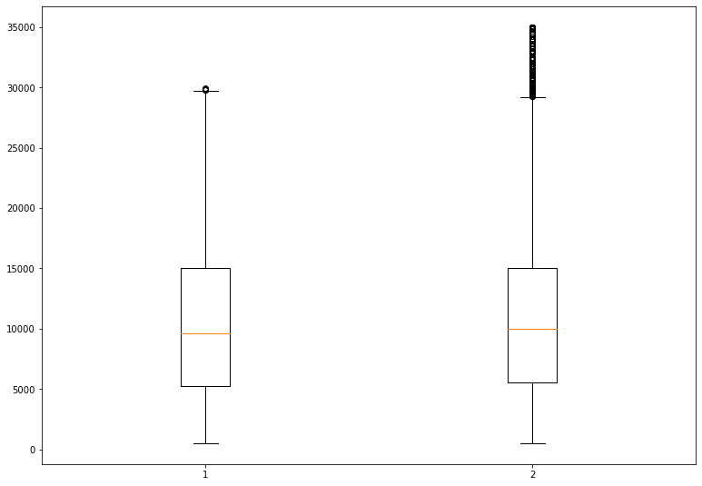
:::

::: {.output .stream .stdout}
    Number of outliers  (828, 40)
:::
:::

::: {#931195c5 .cell .markdown}
It is evident that the loan amount is ranged between `<b>`{=html}5000
and 15000`</b>`{=html} i.e the 1st quartile and the 3rd quartile
respectively with an inter quartile range of
`<b>`{=html}10000`</b>`{=html} and the maximum amount is closer to
`<b>`{=html}30000`</b>`{=html} and the minimum loan amount is closer to
`<b>`{=html}1000`</b>`{=html}. The box plot confirms that outliers are
present for loan amount above `<b>`{=html}30000`</b>`{=html} that are
`<b>`{=html}828 rows/loan accounts`</b>`{=html}.
:::

::: {#ac86691f .cell .code execution_count="27" scrolled="true"}
``` python
print(df.shape)
df = df.drop(df[df['loan_amnt'] >= 30000].index)
print(df.shape)
```

::: {.output .stream .stdout}
    (39664, 40)
    (38459, 40)
:::
:::

::: {#7e47bc7c .cell .markdown}
### Remove outliers from `Annual Income` column
:::

::: {#340678bb .cell .code execution_count="28"}
``` python
annual_income_data = [df[df['annual_inc'] < 127500].annual_inc, df['annual_inc']]
annual_income_fig = plt.figure(figsize =(10, 7))
ax = annual_income_fig.add_axes([0,0,1,1])
ax.boxplot(annual_income_data)
plt.show()
```

::: {.output .display_data}
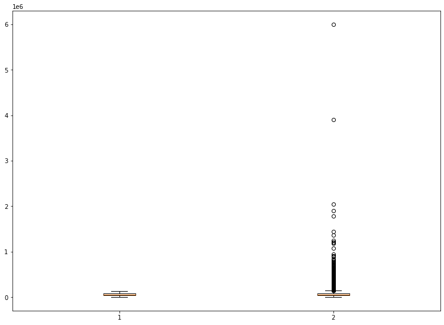
:::
:::

::: {#cecfba00 .cell .code execution_count="29"}
``` python
df = df.drop(df[df['annual_inc'] >= 127500].index)
print(df.shape)
```

::: {.output .stream .stdout}
    (36039, 40)
:::
:::

::: {#5cfa4e10 .cell .code execution_count="30"}
``` python
annual_income_data = df['annual_inc']
annual_income_fig = plt.figure(figsize =(10, 7))
ax = annual_income_fig.add_axes([0,0,1,1])
ax.boxplot(annual_income_data)
plt.show()
```

::: {.output .display_data}
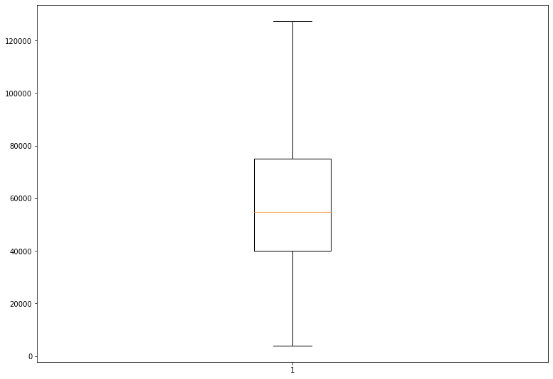
:::
:::

::: {#556e0b41 .cell .code execution_count="31"}
``` python
df['int_rate'] = pd.to_numeric(df['int_rate'].str.rstrip("%"))
```
:::

::: {#6b881628 .cell .code execution_count="32"}
``` python
annual_income_data = [df[df['int_rate'] < 22 ].int_rate, df['int_rate']]
annual_income_fig = plt.figure(figsize =(10, 7))
ax = annual_income_fig.add_axes([0,0,1,1])
ax.boxplot(annual_income_data)
plt.show()
```

::: {.output .display_data}
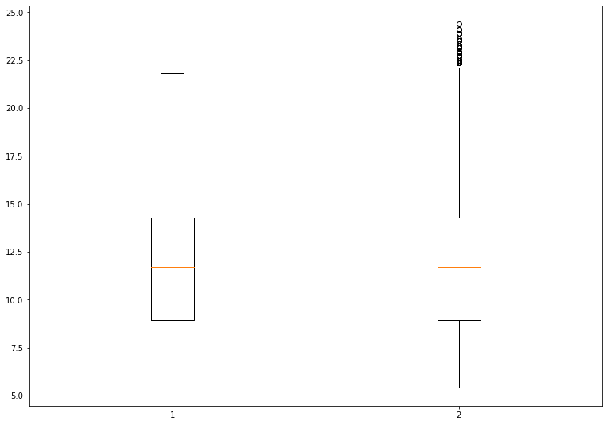
:::
:::

::: {#32adfc06 .cell .code execution_count="33" scrolled="true"}
``` python
df = df.drop(df[df['int_rate'] > 22 ].index)
print(df.shape)
```

::: {.output .stream .stdout}
    (35931, 40)
:::
:::

::: {#c42b0535 .cell .code execution_count="34"}
``` python
int_rate_bins = [0, 5, 10, 12.5, 15, 22]
int_rate_labels = ['0-5', '5-10', '10-12.5', '12.5-15', '15+']
df['int_rate'] = pd.to_numeric(df['int_rate'], errors='coerce')
# Creating a new column 'int_rate_catgs' based on the categorized interest rates
df['int_rate_catgs'] = pd.cut(df['int_rate'], bins=int_rate_bins, labels=int_rate_labels)
```
:::

::: {#4f1ed25f .cell .code execution_count="35"}
``` python
df['int_rate_catgs'].head()
```

::: {.output .execute_result execution_count="35"}
    0    10-12.5
    1        15+
    2        15+
    3    12.5-15
    4    12.5-15
    Name: int_rate_catgs, dtype: category
    Categories (5, object): ['0-5' < '5-10' < '10-12.5' < '12.5-15' < '15+']
:::
:::

::: {#fc7cfd3f .cell .code execution_count="36"}
``` python
# def normalise_loan_amnt(loan_amount):
#     if loan_amount >= 500 and loan_amount < 5500:
#         return "Low"
#     elif loan_amount >= 5500 and loan_amount < 10000:
#         return "Medium"
#     elif loan_amount >= 10000 and loan_amount < 15000:
#         return "High"
#     elif loan_amount >= 15000:
#         return "Very High"
```
:::

::: {#7f1d76ee .cell .markdown}
```{=html}
<h2>Bivariate Analysis</h2>
```
:::

::: {#3730dc2f .cell .code execution_count="37"}
``` python
# Purpose of Loan against Chargedoff_Proportion.

# Grouping the data by 'purpose' and 'loan_status' to analyze the loan status distribution
purpose_vs_loan = df.groupby(['purpose', 'loan_status']).loan_status.count().unstack().fillna(0).reset_index()
purpose_vs_loan['Total'] = purpose_vs_loan['Charged Off'] + purpose_vs_loan['Current'] + purpose_vs_loan['Fully Paid']
purpose_vs_loan['Chargedoff_Proportion'] = purpose_vs_loan['Charged Off'] / purpose_vs_loan['Total']
purpose_vs_loan.sort_values('Chargedoff_Proportion', ascending=False)
```

::: {.output .execute_result execution_count="37"}
```{=html}
<div>
<style scoped>
    .dataframe tbody tr th:only-of-type {
        vertical-align: middle;
    }

    .dataframe tbody tr th {
        vertical-align: top;
    }

    .dataframe thead th {
        text-align: right;
    }
</style>
<table border="1" class="dataframe">
  <thead>
    <tr style="text-align: right;">
      <th>loan_status</th>
      <th>purpose</th>
      <th>Charged Off</th>
      <th>Current</th>
      <th>Fully Paid</th>
      <th>Total</th>
      <th>Chargedoff_Proportion</th>
    </tr>
  </thead>
  <tbody>
    <tr>
      <th>11</th>
      <td>small_business</td>
      <td>406.0</td>
      <td>59.0</td>
      <td>1092.0</td>
      <td>1557.0</td>
      <td>0.260758</td>
    </tr>
    <tr>
      <th>10</th>
      <td>renewable_energy</td>
      <td>17.0</td>
      <td>1.0</td>
      <td>74.0</td>
      <td>92.0</td>
      <td>0.184783</td>
    </tr>
    <tr>
      <th>3</th>
      <td>educational</td>
      <td>54.0</td>
      <td>0.0</td>
      <td>254.0</td>
      <td>308.0</td>
      <td>0.175325</td>
    </tr>
    <tr>
      <th>8</th>
      <td>moving</td>
      <td>88.0</td>
      <td>7.0</td>
      <td>437.0</td>
      <td>532.0</td>
      <td>0.165414</td>
    </tr>
    <tr>
      <th>9</th>
      <td>other</td>
      <td>580.0</td>
      <td>110.0</td>
      <td>3014.0</td>
      <td>3704.0</td>
      <td>0.156587</td>
    </tr>
    <tr>
      <th>7</th>
      <td>medical</td>
      <td>98.0</td>
      <td>6.0</td>
      <td>523.0</td>
      <td>627.0</td>
      <td>0.156300</td>
    </tr>
    <tr>
      <th>5</th>
      <td>house</td>
      <td>49.0</td>
      <td>9.0</td>
      <td>272.0</td>
      <td>330.0</td>
      <td>0.148485</td>
    </tr>
    <tr>
      <th>2</th>
      <td>debt_consolidation</td>
      <td>2485.0</td>
      <td>471.0</td>
      <td>13981.0</td>
      <td>16937.0</td>
      <td>0.146720</td>
    </tr>
    <tr>
      <th>12</th>
      <td>vacation</td>
      <td>51.0</td>
      <td>5.0</td>
      <td>306.0</td>
      <td>362.0</td>
      <td>0.140884</td>
    </tr>
    <tr>
      <th>4</th>
      <td>home_improvement</td>
      <td>299.0</td>
      <td>71.0</td>
      <td>2084.0</td>
      <td>2454.0</td>
      <td>0.121842</td>
    </tr>
    <tr>
      <th>1</th>
      <td>credit_card</td>
      <td>493.0</td>
      <td>80.0</td>
      <td>4081.0</td>
      <td>4654.0</td>
      <td>0.105930</td>
    </tr>
    <tr>
      <th>0</th>
      <td>car</td>
      <td>156.0</td>
      <td>49.0</td>
      <td>1268.0</td>
      <td>1473.0</td>
      <td>0.105906</td>
    </tr>
    <tr>
      <th>6</th>
      <td>major_purchase</td>
      <td>211.0</td>
      <td>32.0</td>
      <td>1777.0</td>
      <td>2020.0</td>
      <td>0.104455</td>
    </tr>
    <tr>
      <th>13</th>
      <td>wedding</td>
      <td>88.0</td>
      <td>19.0</td>
      <td>774.0</td>
      <td>881.0</td>
      <td>0.099886</td>
    </tr>
  </tbody>
</table>
</div>
```
:::
:::

::: {#b8878c28 .cell .code execution_count="38"}
``` python
# Plotting the graph
# Sorting the dataframe by the proportion of charged off cases in descending order
purpose_vs_loan_sorted = purpose_vs_loan.sort_values('Chargedoff_Proportion', ascending=False)

plt.figure(figsize=(10, 6))
plt.bar(purpose_vs_loan_sorted['purpose'], purpose_vs_loan_sorted['Chargedoff_Proportion'])
plt.xlabel('Purpose')
plt.ylabel('Charged off Proportion')
plt.title('Charged off Proportion by Purpose')
plt.xticks(rotation=45)
plt.show()
```

::: {.output .display_data}
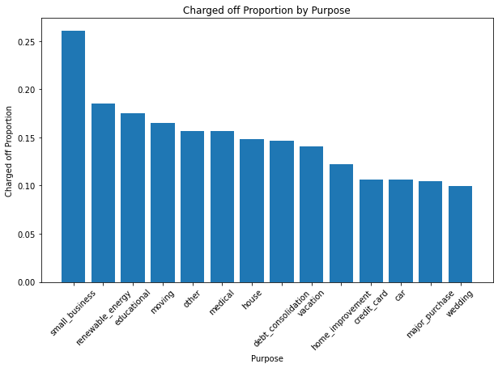
:::
:::

::: {#f45ff32a .cell .markdown}
`<font color="Blue">`{=html}`<h4>`{=html}Upon careful examination, it
was observed that small business applicants face a significant risk of
being charged off.`</h4>`{=html}`</font>`{=html}
`<font color="Blue">`{=html}`<h4>`{=html}When analyzing the data, it
becomes evident that the proportion of charged off cases is
comparatively higher in the renewable energy category than in other
categories.`</h4>`{=html} `</font>`{=html}
:::

::: {#cc9a647c .cell .code execution_count="39"}
``` python
#Conducting a bivariate analysis on the variable 'grade' in relation to the proportion of charged off cases.

grade_vs_loan = df.groupby(['grade', 'loan_status']).loan_status.count().unstack().fillna(0).reset_index()
grade_vs_loan['Total'] = grade_vs_loan['Charged Off'] + grade_vs_loan['Current'] + grade_vs_loan['Fully Paid']
grade_vs_loan['Chargedoff_Proportion'] = grade_vs_loan['Charged Off'] / grade_vs_loan['Total']
grade_vs_loan_sorted = grade_vs_loan.sort_values('Chargedoff_Proportion', ascending=False)
grade_vs_loan_sorted
```

::: {.output .execute_result execution_count="39"}
```{=html}
<div>
<style scoped>
    .dataframe tbody tr th:only-of-type {
        vertical-align: middle;
    }

    .dataframe tbody tr th {
        vertical-align: top;
    }

    .dataframe thead th {
        text-align: right;
    }
</style>
<table border="1" class="dataframe">
  <thead>
    <tr style="text-align: right;">
      <th>loan_status</th>
      <th>grade</th>
      <th>Charged Off</th>
      <th>Current</th>
      <th>Fully Paid</th>
      <th>Total</th>
      <th>Chargedoff_Proportion</th>
    </tr>
  </thead>
  <tbody>
    <tr>
      <th>6</th>
      <td>G</td>
      <td>50.0</td>
      <td>0.0</td>
      <td>105.0</td>
      <td>155.0</td>
      <td>0.322581</td>
    </tr>
    <tr>
      <th>5</th>
      <td>F</td>
      <td>229.0</td>
      <td>38.0</td>
      <td>506.0</td>
      <td>773.0</td>
      <td>0.296248</td>
    </tr>
    <tr>
      <th>4</th>
      <td>E</td>
      <td>586.0</td>
      <td>140.0</td>
      <td>1585.0</td>
      <td>2311.0</td>
      <td>0.253570</td>
    </tr>
    <tr>
      <th>3</th>
      <td>D</td>
      <td>1023.0</td>
      <td>193.0</td>
      <td>3579.0</td>
      <td>4795.0</td>
      <td>0.213347</td>
    </tr>
    <tr>
      <th>2</th>
      <td>C</td>
      <td>1265.0</td>
      <td>227.0</td>
      <td>5931.0</td>
      <td>7423.0</td>
      <td>0.170416</td>
    </tr>
    <tr>
      <th>1</th>
      <td>B</td>
      <td>1338.0</td>
      <td>282.0</td>
      <td>9399.0</td>
      <td>11019.0</td>
      <td>0.121427</td>
    </tr>
    <tr>
      <th>0</th>
      <td>A</td>
      <td>584.0</td>
      <td>39.0</td>
      <td>8832.0</td>
      <td>9455.0</td>
      <td>0.061766</td>
    </tr>
  </tbody>
</table>
</div>
```
:::
:::

::: {#1c5d6739 .cell .code execution_count="40"}
``` python
# Plotting the graph
plt.figure(figsize=(10, 6))
plt.bar(grade_vs_loan_sorted['grade'], grade_vs_loan_sorted['Chargedoff_Proportion'])
plt.xlabel('Grade')
plt.ylabel('Charged off Proportion')
plt.title('Charged off Proportion by Grade')
plt.show()
```

::: {.output .display_data}
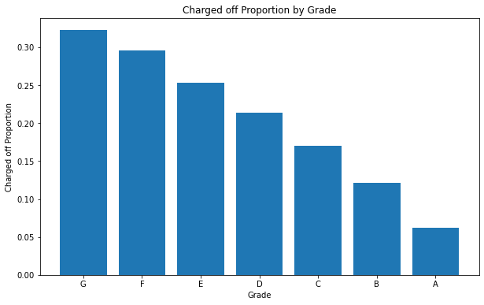
:::
:::

::: {#49798410 .cell .markdown}
```{=html}
<h3>The analysis reveals the following observations: </h3>
```
`<br>`{=html} `<li>`{=html}Grade \'A\' shows a significantly low
likelihood of being charged off. `<li>`{=html}Grades \'F\' and \'G\'
exhibit a considerably high likelihood of being charged off.
`<li>`{=html}The likelihood of charged off cases increases progressively
from grade \'A\' to grade \'G\'.
:::

::: {#30944d3c .cell .code execution_count="41"}
``` python
#Conducting a bivariate analysis on the variable 'sub_grade' in relation to the proportion of charged off cases.

subgrade_vs_loan = df.groupby(['sub_grade', 'loan_status']).loan_status.count().unstack().fillna(0).reset_index()
subgrade_vs_loan['Total'] = subgrade_vs_loan['Charged Off'] + subgrade_vs_loan['Current'] + subgrade_vs_loan['Fully Paid']
subgrade_vs_loan['Chargedoff_Proportion'] = subgrade_vs_loan['Charged Off'] / subgrade_vs_loan['Total']
subgrade_vs_loan_sorted = subgrade_vs_loan.sort_values('Chargedoff_Proportion', ascending=False)
```
:::

::: {#03b0cf9a .cell .code execution_count="42"}
``` python
subgrade_vs_loan_sorted
```

::: {.output .execute_result execution_count="42"}
```{=html}
<div>
<style scoped>
    .dataframe tbody tr th:only-of-type {
        vertical-align: middle;
    }

    .dataframe tbody tr th {
        vertical-align: top;
    }

    .dataframe thead th {
        text-align: right;
    }
</style>
<table border="1" class="dataframe">
  <thead>
    <tr style="text-align: right;">
      <th>loan_status</th>
      <th>sub_grade</th>
      <th>Charged Off</th>
      <th>Current</th>
      <th>Fully Paid</th>
      <th>Total</th>
      <th>Chargedoff_Proportion</th>
    </tr>
  </thead>
  <tbody>
    <tr>
      <th>29</th>
      <td>F5</td>
      <td>34.0</td>
      <td>1.0</td>
      <td>37.0</td>
      <td>72.0</td>
      <td>0.472222</td>
    </tr>
    <tr>
      <th>32</th>
      <td>G3</td>
      <td>11.0</td>
      <td>0.0</td>
      <td>13.0</td>
      <td>24.0</td>
      <td>0.458333</td>
    </tr>
    <tr>
      <th>34</th>
      <td>G5</td>
      <td>7.0</td>
      <td>0.0</td>
      <td>10.0</td>
      <td>17.0</td>
      <td>0.411765</td>
    </tr>
    <tr>
      <th>31</th>
      <td>G2</td>
      <td>14.0</td>
      <td>0.0</td>
      <td>27.0</td>
      <td>41.0</td>
      <td>0.341463</td>
    </tr>
    <tr>
      <th>23</th>
      <td>E4</td>
      <td>107.0</td>
      <td>20.0</td>
      <td>245.0</td>
      <td>372.0</td>
      <td>0.287634</td>
    </tr>
    <tr>
      <th>26</th>
      <td>F2</td>
      <td>56.0</td>
      <td>9.0</td>
      <td>130.0</td>
      <td>195.0</td>
      <td>0.287179</td>
    </tr>
    <tr>
      <th>27</th>
      <td>F3</td>
      <td>42.0</td>
      <td>8.0</td>
      <td>98.0</td>
      <td>148.0</td>
      <td>0.283784</td>
    </tr>
    <tr>
      <th>28</th>
      <td>F4</td>
      <td>31.0</td>
      <td>6.0</td>
      <td>73.0</td>
      <td>110.0</td>
      <td>0.281818</td>
    </tr>
    <tr>
      <th>24</th>
      <td>E5</td>
      <td>83.0</td>
      <td>20.0</td>
      <td>198.0</td>
      <td>301.0</td>
      <td>0.275748</td>
    </tr>
    <tr>
      <th>33</th>
      <td>G4</td>
      <td>7.0</td>
      <td>0.0</td>
      <td>19.0</td>
      <td>26.0</td>
      <td>0.269231</td>
    </tr>
    <tr>
      <th>25</th>
      <td>F1</td>
      <td>66.0</td>
      <td>14.0</td>
      <td>168.0</td>
      <td>248.0</td>
      <td>0.266129</td>
    </tr>
    <tr>
      <th>20</th>
      <td>E1</td>
      <td>163.0</td>
      <td>34.0</td>
      <td>441.0</td>
      <td>638.0</td>
      <td>0.255486</td>
    </tr>
    <tr>
      <th>19</th>
      <td>D5</td>
      <td>188.0</td>
      <td>31.0</td>
      <td>546.0</td>
      <td>765.0</td>
      <td>0.245752</td>
    </tr>
    <tr>
      <th>21</th>
      <td>E2</td>
      <td>132.0</td>
      <td>35.0</td>
      <td>379.0</td>
      <td>546.0</td>
      <td>0.241758</td>
    </tr>
    <tr>
      <th>30</th>
      <td>G1</td>
      <td>11.0</td>
      <td>0.0</td>
      <td>36.0</td>
      <td>47.0</td>
      <td>0.234043</td>
    </tr>
    <tr>
      <th>18</th>
      <td>D4</td>
      <td>198.0</td>
      <td>57.0</td>
      <td>626.0</td>
      <td>881.0</td>
      <td>0.224745</td>
    </tr>
    <tr>
      <th>22</th>
      <td>E3</td>
      <td>101.0</td>
      <td>31.0</td>
      <td>322.0</td>
      <td>454.0</td>
      <td>0.222467</td>
    </tr>
    <tr>
      <th>17</th>
      <td>D3</td>
      <td>229.0</td>
      <td>49.0</td>
      <td>786.0</td>
      <td>1064.0</td>
      <td>0.215226</td>
    </tr>
    <tr>
      <th>16</th>
      <td>D2</td>
      <td>255.0</td>
      <td>56.0</td>
      <td>919.0</td>
      <td>1230.0</td>
      <td>0.207317</td>
    </tr>
    <tr>
      <th>14</th>
      <td>C5</td>
      <td>197.0</td>
      <td>30.0</td>
      <td>846.0</td>
      <td>1073.0</td>
      <td>0.183597</td>
    </tr>
    <tr>
      <th>12</th>
      <td>C3</td>
      <td>258.0</td>
      <td>37.0</td>
      <td>1116.0</td>
      <td>1411.0</td>
      <td>0.182849</td>
    </tr>
    <tr>
      <th>15</th>
      <td>D1</td>
      <td>153.0</td>
      <td>0.0</td>
      <td>702.0</td>
      <td>855.0</td>
      <td>0.178947</td>
    </tr>
    <tr>
      <th>13</th>
      <td>C4</td>
      <td>202.0</td>
      <td>27.0</td>
      <td>924.0</td>
      <td>1153.0</td>
      <td>0.175195</td>
    </tr>
    <tr>
      <th>11</th>
      <td>C2</td>
      <td>301.0</td>
      <td>64.0</td>
      <td>1467.0</td>
      <td>1832.0</td>
      <td>0.164301</td>
    </tr>
    <tr>
      <th>10</th>
      <td>C1</td>
      <td>307.0</td>
      <td>69.0</td>
      <td>1578.0</td>
      <td>1954.0</td>
      <td>0.157114</td>
    </tr>
    <tr>
      <th>9</th>
      <td>B5</td>
      <td>339.0</td>
      <td>76.0</td>
      <td>2072.0</td>
      <td>2487.0</td>
      <td>0.136309</td>
    </tr>
    <tr>
      <th>8</th>
      <td>B4</td>
      <td>310.0</td>
      <td>55.0</td>
      <td>1942.0</td>
      <td>2307.0</td>
      <td>0.134374</td>
    </tr>
    <tr>
      <th>7</th>
      <td>B3</td>
      <td>312.0</td>
      <td>71.0</td>
      <td>2227.0</td>
      <td>2610.0</td>
      <td>0.119540</td>
    </tr>
    <tr>
      <th>6</th>
      <td>B2</td>
      <td>212.0</td>
      <td>52.0</td>
      <td>1647.0</td>
      <td>1911.0</td>
      <td>0.110937</td>
    </tr>
    <tr>
      <th>5</th>
      <td>B1</td>
      <td>165.0</td>
      <td>28.0</td>
      <td>1511.0</td>
      <td>1704.0</td>
      <td>0.096831</td>
    </tr>
    <tr>
      <th>4</th>
      <td>A5</td>
      <td>211.0</td>
      <td>26.0</td>
      <td>2324.0</td>
      <td>2561.0</td>
      <td>0.082390</td>
    </tr>
    <tr>
      <th>3</th>
      <td>A4</td>
      <td>171.0</td>
      <td>13.0</td>
      <td>2501.0</td>
      <td>2685.0</td>
      <td>0.063687</td>
    </tr>
    <tr>
      <th>2</th>
      <td>A3</td>
      <td>99.0</td>
      <td>0.0</td>
      <td>1612.0</td>
      <td>1711.0</td>
      <td>0.057861</td>
    </tr>
    <tr>
      <th>1</th>
      <td>A2</td>
      <td>73.0</td>
      <td>0.0</td>
      <td>1348.0</td>
      <td>1421.0</td>
      <td>0.051372</td>
    </tr>
    <tr>
      <th>0</th>
      <td>A1</td>
      <td>30.0</td>
      <td>0.0</td>
      <td>1047.0</td>
      <td>1077.0</td>
      <td>0.027855</td>
    </tr>
  </tbody>
</table>
</div>
```
:::
:::

::: {#0eb87f85 .cell .code execution_count="43"}
``` python
# Plotting the graph
plt.figure(figsize=(10, 6))
plt.bar(subgrade_vs_loan_sorted['sub_grade'], subgrade_vs_loan_sorted['Chargedoff_Proportion'])
plt.xlabel('Sub Grade')
plt.ylabel('Charged off Proportion')
plt.title('Charged off Proportion by Sub Grade')
plt.show()
```

::: {.output .display_data}
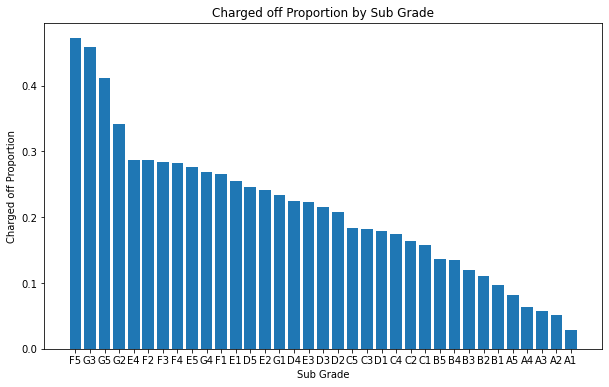
:::
:::

::: {#c0a988de .cell .markdown}
```{=html}
<h3>The analysis reveals the following observations: </h3>
```
`<br>`{=html} `<li>`{=html}\"A\" sub grades exhibit a significantly
lower likelihood of being charged off. `<li>`{=html}\"F\" and \"G\" sub
grades have a considerably higher likelihood of being charged off.
`<li>`{=html}The proportion of charged off cases increases progressively
as we move from \"A\" sub grades towards \"G\" sub grades.
:::

::: {#33a6029a .cell .code execution_count="53"}
``` python
# Conducting a bivariate analysis on the variable 'home_ownership' in relation to the proportion of charged off cases
home_ownership_vs_loan = df.groupby(['home_ownership', 'loan_status']).loan_status.count().unstack().fillna(0).reset_index()
home_ownership_vs_loan['Total'] = home_ownership_vs_loan['Charged Off'] + home_ownership_vs_loan['Current'] + home_ownership_vs_loan['Fully Paid']
home_ownership_vs_loan['Chargedoff_Proportion'] = home_ownership_vs_loan['Charged Off'] / home_ownership_vs_loan['Total']
home_ownership_vs_loan_sorted = home_ownership_vs_loan.sort_values('Chargedoff_Proportion', ascending=False)

# Plotting the graph
plt.figure(figsize=(10, 6))
plt.bar(home_ownership_vs_loan_sorted['home_ownership'], home_ownership_vs_loan_sorted['Chargedoff_Proportion'])
plt.xlabel('Home Ownership')
plt.ylabel('Charged off Proportion')
plt.title('Charged off Proportion by Home Ownership')
plt.show()
```

::: {.output .display_data}
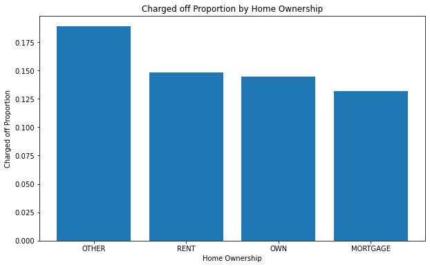
:::
:::

::: {#7719ff42 .cell .markdown}
```{=html}
<h3>The analysis reveals the following observations: </h3>
```
`<br>`{=html} `<li>`{=html}People who\'s Home Ownership is \"OTHER\" has
more likelihood of being charged off.
:::

::: {#8dd42b2b .cell .code execution_count="56"}
``` python

# Conducting a bivariate analysis on the variable 'revol_util_categories' in relation to the proportion of charged off cases
revol_util_categories_vs_loan = df.groupby(['revol_util_categories', 'loan_status']).loan_status.count().unstack().fillna(0).reset_index()
revol_util_categories_vs_loan['Total'] = revol_util_categories_vs_loan['Charged Off'] + revol_util_categories_vs_loan['Current'] + revol_util_categories_vs_loan['Fully Paid']
revol_util_categories_vs_loan['Chargedoff_Proportion'] = revol_util_categories_vs_loan['Charged Off'] / revol_util_categories_vs_loan['Total']
revol_util_categories_vs_loan_sorted = revol_util_categories_vs_loan.sort_values('Chargedoff_Proportion', ascending=False)

# Plotting the graph
plt.figure(figsize=(10, 6))
plt.bar(revol_util_categories_vs_loan_sorted['revol_util_categories'], revol_util_categories_vs_loan_sorted['Chargedoff_Proportion'])
plt.xlabel('revol_util_categories')
plt.ylabel('Charged off Proportion')
plt.title('Charged off Proportion by revol_util_categories')
plt.show()
```

::: {.output .display_data}
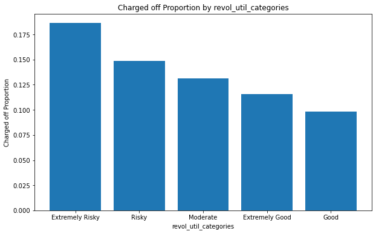
:::
:::

::: {#04315520 .cell .markdown}
```{=html}
<h3>The analysis reveals the following observations: </h3>
```
`<br>`{=html} Reference :
`<a href="https://www.ondeck.com/resources/dont-mess-up-your-fico-score-manage-your-revolving-credit-usage#:~:text=50%25%20to%2075%25%3A%20This,more%20reasonable%20to%20a%20lender">`{=html}
Link`</a>`{=html}`<br>`{=html}

```{=html}
<h1>Please add!!!! Analysis points</h1>
```
:::

::: {#2b07a63a .cell .code execution_count="57"}
``` python
df['term']
```

::: {.output .execute_result execution_count="57"}
    0         36 months
    1         60 months
    2         36 months
    3         36 months
    4         60 months
                ...    
    39711     36 months
    39712     36 months
    39713     36 months
    39714     36 months
    39716     36 months
    Name: term, Length: 35931, dtype: object
:::
:::

::: {#29627d13 .cell .code execution_count="61"}
``` python
# Conducting a bivariate analysis on the variable 'term' in relation to the proportion of charged off cases
term_vs_loan = df.groupby(['term', 'loan_status']).loan_status.count().unstack().fillna(0).reset_index()
term_vs_loan['Total'] = term_vs_loan['Charged Off'] + term_vs_loan['Current'] + term_vs_loan['Fully Paid']
term_vs_loan['Chargedoff_Proportion'] = term_vs_loan['Charged Off'] / term_vs_loan['Total']
term_vs_loan_sorted = term_vs_loan.sort_values('Chargedoff_Proportion', ascending=False)
term_vs_loan_sorted

# Plotting the graph
plt.figure(figsize=(10, 6))
plt.bar(term_vs_loan_sorted['term'], term_vs_loan_sorted['Chargedoff_Proportion'])
plt.xlabel('Term')
plt.ylabel('Charged off Proportion')
plt.title('Charged off Proportion by Term')
plt.show()
```

::: {.output .display_data}
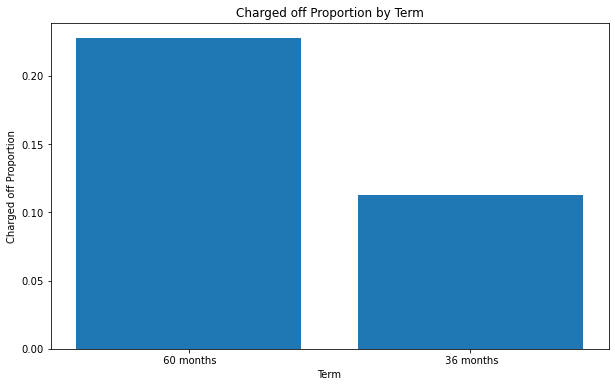
:::
:::

::: {#097b7149 .cell .markdown}
```{=html}
<h3>The analysis reveals the following observations: </h3>
```
`<br>`{=html} `<li>`{=html}Loans which have tenure of 60 months are more
likly to get Charged off `<li>`{=html}Loans which have tenure of 36
months are less likly to get Charged Off
:::

::: {#ead08210 .cell .code execution_count="72"}
``` python
# Converting int_rate into Categories for visulization 
df['int_rate_cats'] = pd.cut(df['int_rate'], [0, 5, 10, 12.5, 15, 20], labels=['0-5', '5-10', '10-13', '12.5-15', '15+'])
df['int_rate_cats']
```

::: {.output .execute_result execution_count="72"}
    0          10-13
    1            15+
    2            15+
    3        12.5-15
    4        12.5-15
              ...   
    39711       5-10
    39712       5-10
    39713      10-13
    39714       5-10
    39716    12.5-15
    Name: int_rate_cats, Length: 35931, dtype: category
    Categories (5, object): ['0-5' < '5-10' < '10-13' < '12.5-15' < '15+']
:::
:::

::: {#f887b36f .cell .code execution_count="73"}
``` python
# Bivariate Analysis on interest rate against Chargedoff_Proportion
int_rate_vs_loan = df.groupby(['int_rate_cats', 'loan_status']).loan_status.count().unstack().fillna(0).reset_index()
int_rate_vs_loan['Total'] = int_rate_vs_loan['Charged Off'] + int_rate_vs_loan['Current'] + int_rate_vs_loan['Fully Paid'] 
int_rate_vs_loan['Chargedoff_Proportion'] = int_rate_vs_loan['Charged Off'] / int_rate_vs_loan['Total']
interest_vs_loan_sorted = int_rate_vs_loan.sort_values('Chargedoff_Proportion', ascending=False)
interest_vs_loan_sorted
```

::: {.output .execute_result execution_count="73"}
```{=html}
<div>
<style scoped>
    .dataframe tbody tr th:only-of-type {
        vertical-align: middle;
    }

    .dataframe tbody tr th {
        vertical-align: top;
    }

    .dataframe thead th {
        text-align: right;
    }
</style>
<table border="1" class="dataframe">
  <thead>
    <tr style="text-align: right;">
      <th>loan_status</th>
      <th>int_rate_cats</th>
      <th>Charged Off</th>
      <th>Current</th>
      <th>Fully Paid</th>
      <th>Total</th>
      <th>Chargedoff_Proportion</th>
    </tr>
  </thead>
  <tbody>
    <tr>
      <th>4</th>
      <td>15+</td>
      <td>1572</td>
      <td>366</td>
      <td>4689</td>
      <td>6627</td>
      <td>0.237211</td>
    </tr>
    <tr>
      <th>3</th>
      <td>12.5-15</td>
      <td>1375</td>
      <td>217</td>
      <td>6786</td>
      <td>8378</td>
      <td>0.164120</td>
    </tr>
    <tr>
      <th>2</th>
      <td>10-13</td>
      <td>1157</td>
      <td>219</td>
      <td>7454</td>
      <td>8830</td>
      <td>0.131031</td>
    </tr>
    <tr>
      <th>1</th>
      <td>5-10</td>
      <td>801</td>
      <td>71</td>
      <td>10737</td>
      <td>11609</td>
      <td>0.068998</td>
    </tr>
    <tr>
      <th>0</th>
      <td>0-5</td>
      <td>0</td>
      <td>0</td>
      <td>0</td>
      <td>0</td>
      <td>NaN</td>
    </tr>
  </tbody>
</table>
</div>
```
:::
:::

::: {#e0e7a25c .cell .markdown}
```{=html}
<h3>The analysis reveals the following observations: </h3>
```
`<br>`{=html} `<li>`{=html}Loans with interest rates less than 10% have
a significantly lower chance of being charged off. The minimum interest
rate observed is 5%. `<li>`{=html}Loans with interest rates higher than
15% have a higher proportion of charged off cases compared to other
interest rate categories. `<li>`{=html}The proportion of charged off
cases increases with higher interest rates.
:::

::: {#81241517 .cell .code}
``` python
```
:::

::: {#250c685c .cell .code}
``` python
```
:::

::: {#7cd5c1e3 .cell .code}
``` python
```
:::

::: {#5e2edac1 .cell .code execution_count="44"}
``` python
df.pivot_table(values='revol_util_categories',columns=['loan_status'], aggfunc='count').unstack()
```

::: {.output .execute_result execution_count="44"}
    loan_status                       
    Charged Off  revol_util_categories     5075
    Current      revol_util_categories      919
    Fully Paid   revol_util_categories    29937
    dtype: int64
:::
:::

::: {#7850002f .cell .code execution_count="45"}
``` python
df.groupby(['revol_util_categories', 'loan_status']).revol_util_categories.count().unstack().fillna(0).reset_index()
```

::: {.output .execute_result execution_count="45"}
```{=html}
<div>
<style scoped>
    .dataframe tbody tr th:only-of-type {
        vertical-align: middle;
    }

    .dataframe tbody tr th {
        vertical-align: top;
    }

    .dataframe thead th {
        text-align: right;
    }
</style>
<table border="1" class="dataframe">
  <thead>
    <tr style="text-align: right;">
      <th>loan_status</th>
      <th>revol_util_categories</th>
      <th>Charged Off</th>
      <th>Current</th>
      <th>Fully Paid</th>
    </tr>
  </thead>
  <tbody>
    <tr>
      <th>0</th>
      <td>Extremely Good</td>
      <td>283</td>
      <td>47</td>
      <td>2116</td>
    </tr>
    <tr>
      <th>1</th>
      <td>Extremely Risky</td>
      <td>1808</td>
      <td>270</td>
      <td>7628</td>
    </tr>
    <tr>
      <th>2</th>
      <td>Good</td>
      <td>813</td>
      <td>173</td>
      <td>7271</td>
    </tr>
    <tr>
      <th>3</th>
      <td>Moderate</td>
      <td>1014</td>
      <td>193</td>
      <td>6534</td>
    </tr>
    <tr>
      <th>4</th>
      <td>Risky</td>
      <td>1157</td>
      <td>236</td>
      <td>6388</td>
    </tr>
  </tbody>
</table>
</div>
```
:::
:::
